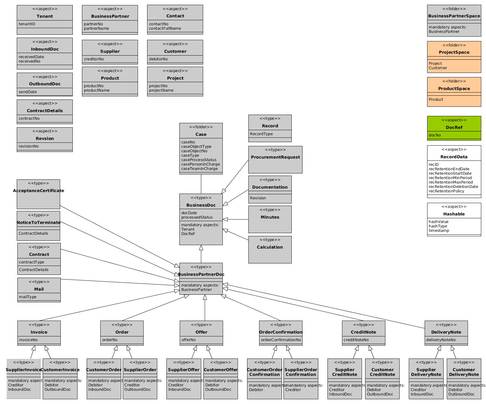

[](https://travis-ci.org/ecm4u/businessdocumentmodel)

# ecm4u Business Document Model

The heart of this project is an Alfresco model called the "ecm4u Business Document Model".
It is defined in an [Alfresco model XML file](src/main/amp/config/alfresco/module/businessdocumentmodel/model/BusinessDocumentsModel.xml)
and described below.

## Build

The Alfresco module is configure in the [pom.xml](pom.xml) to build using the current Alfresco SDK 2.2.0 against Alfresco Community 5.1.e.

```
$ mvn package
```

## Installation

Deploy the resulting `target/businessdocumentmodel-1.0-SNAPSHOT.jar` to the `modules/share` directory of your Alfresco installation.
See the Alfresco documentation about [simple modules](https://docs.alfresco.com/5.1/concepts/dev-extensions-packaging-techniques-jar-files.html).

## Configuration

Configuration is not necessary, the model XML will be deployed on startup and be usabel in your code.

But if you want to use the model types, aspects, and properties in Share, configure your `share-config-custom.xml` using
the [example `share-config-custom.xml`](example/share-config-custom.xml).

Examples of Message bundles for Share are provided in [English](example/ecm4u-businessdocumentmodel.properties) and [German](example/ecm4u-businessdocumentmodel_de.properties).
Make them available using a [custom Share Spring context](example/businessdocumentmodel-slingshot-application-context.xml).

## The Business Document Model

The types, aspects, and properties of the model are defined following this graphical model.



## Copyright and License

Copyright &copy; 2016 [ecm4u GmbH](http://www.ecm4u.de/).

This project is licensed under the [GNU LESSER GENERAL PUBLIC LICENSE version 3](LICENSE.txt).
